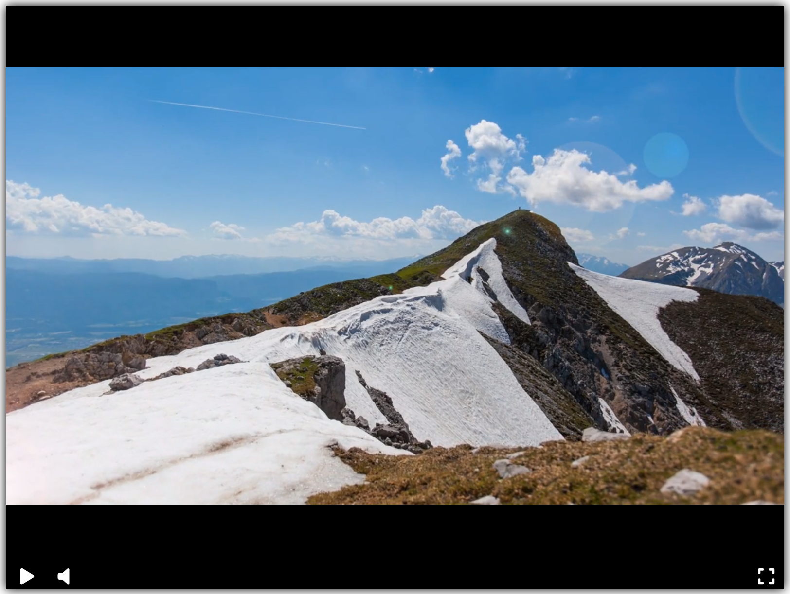

# Видеоплеер

В проекте реализован видеоплеер как на скриншоте:

Пример можно посмотреть на [GitHub Pages](https://uzapolsky.github.io/web-videoplayer/).

### Цель проекта

Код написан в образовательных целях на онлайн-курсе для веб-разработчиков [dvmn.org](https://dvmn.org/).